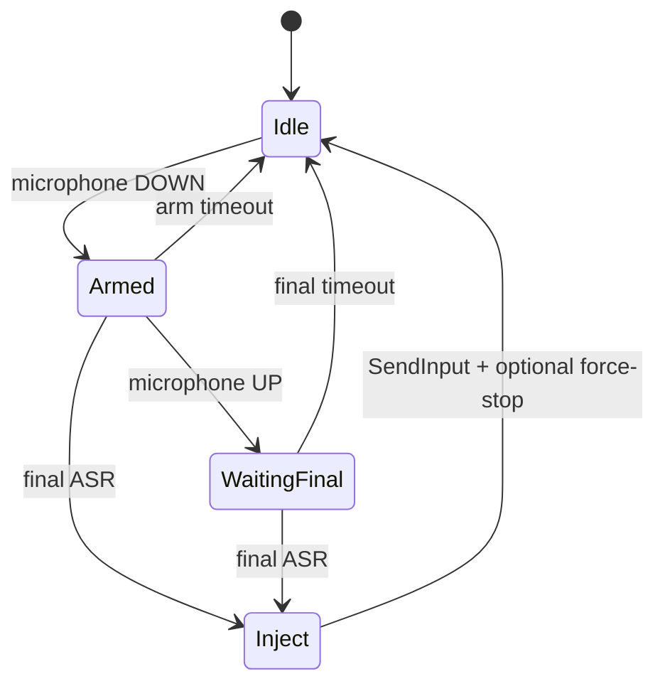

# 架构说明

## 数据路径

桥接程序为每台启用的显示器启动两个长连接：

1. `adb shell getevent -lt /dev/input/eventN`：只判断指定遥控器按键的 DOWN / UP。
2. `adb logcat`：只读取 profile 指定 tag，并用正则提取最终 ASR 文本。

按键 DOWN 会让该设备进入 armed 状态；UP 后保留一个短等待窗口。只有 armed 窗口内、匹配最终结果正则的日志才会进入 Windows。

## 状态流程

每台显示器维护独立的 pressed、armed deadline、dialog ID 集合和最近文本。这样双显示器不会互相解除 armed 状态。

## Windows 文本注入

程序调用 `SendInput`，为每个 UTF-16 code unit 发送一次 `KEYEVENTF_UNICODE` key-down / key-up。`INPUT` union 同时声明 `MOUSEINPUT`、`KEYBDINPUT` 与 `HARDWAREINPUT`，保证 x64 下结构尺寸正确；缺少最大 union 成员会导致 Windows 错误 87。

限制：

- 文本写入“最终结果到达时”的当前前台输入光标。
- 普通权限进程不能向更高完整性级别的管理员窗口注入输入。
- 少数游戏、远程桌面或自绘编辑器会忽略 Unicode SendInput。
- emoji 等超出 BMP 的字符由 UTF-16 surrogate pair 发送，是否正确组合取决于目标应用。

## ADB 进程模型

每个流监听器在断开后等待配置的时间并重新启动。网络 serial 可先执行 `adb connect`。短命令（包启用、force-stop、service action）单独启动 ADB 子进程，并有超时保护。

## 厂商专用层

核心链路只需要按键事件和最终文本。以下都是 profile 可选项：

- 启用语音包；
- 最终识别后强停助手；
- 原生按键没有拉起服务时发送 service action；
- 暂停/退出时禁用语音包。

这些操作不会在通用模板中开启。新机型适配应优先做到纯读取链路可用，再逐项证明厂商专用行为。

## 失败时的安全属性

- 配置字段经过白名单验证，设备 serial、包名和 event 路径不能包含任意 shell 片段。
- 未 armed 的 ASR 日志被忽略。
- 对话 ID 和短时间相同文本会去重。
- 日志默认不保存识别正文。
- 单实例互斥量防止同一 Windows 会话启动多个桥接程序造成重复输入。

这不是安全边界的替代品：ADB 本身拥有很高的设备调试权限，只应在可信 LAN 使用。
